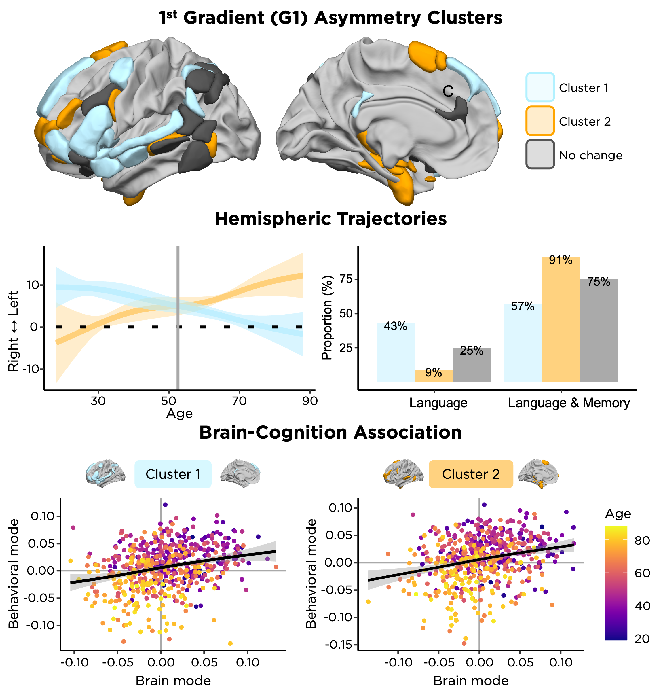

When Age Tips the Balance: a Dual Mechanism Affecting Hemispheric
Specialization for Language
================

------------------------------------------------------------------------

## Contents

- [Background](#background)
- [Reference](#reference)
- [Code Release](#code-release)
- [Atlas Used](#atlas-used)
- [Other related papers that might interest
  you](#other-related-papers-that-might-interest-you)
- [Questions](#questions)

------------------------------------------------------------------------

## Background

**Aging** engenders neuroadaptations, generally *reducing specificity
and selectivity* in functional brain responses. Our investigation delves
into the **functional specialization** of brain hemispheres within
language-related networks across adulthood. In a cohort of 728 healthy
adults spanning ages 18 to 88, we modeled the trajectories of
inter-hemispheric asymmetry concerning the principal functional gradient
across 37 homotopic regions of interest of an extensive language network
known as the **Language-and-Memory Network**. Our findings reveal that
over two-thirds of Language-and-Memory Network homotopic regions of
interest undergo asymmetry changes with age, falling into two main
clusters. The first cluster evolves from left-sided specialization to
right-sided tendencies, while the second cluster transitions from
right-sided asymmetry to left-hemisphere dominance. These reversed
asymmetry shifts manifest around midlife, *occurring after age 50*, and
are associated with poorer language production performance. Our results
provide valuable insights into the **influence of functional brain
asymmetries on language proficiency** and present a **dynamic
perspective on brain plasticity during the typical aging process**.

------------------------------------------------------------------------

## Reference

For usage of the ***manuscript***, please cite:

- Roger, E., **Labache, L.**, Hamlin, N., Kruse, J., Baciu, M., &
  Doucet, G. E. (2023). When age tips the balance: a dual mechanisms
  affecting hemispheric specialization for language. *BioRxiv* (2023).
  DOI:
  [10.1101/2023.12.04.569978](https://doi.org/10.1101/2023.12.04.569978)

For usage of the associated ***code***, please also cite:

- **Labache, L.**, Roger, E., Hamlin, N., Kruse, J., Baciu, M., &
  Doucet, G. E. (2023). When age tips the balance: a dual mechanisms
  affecting hemispheric specialization for language.
  loiclabache/RogerLabache_2023_LanguAging. DOI:
  [10.5281/zenodo.10253278](https://zenodo.org/doi/10.5281/zenodo.10253278)
- The *original Generalized Additive Mixed Models Code* for structural
  MRI data: Roe, J., et al. 2021. DOI:
  [10.1038/s41467-021-21057-y](https://doi.org/10.1038/s41467-021-21057-y),
  and related GitHub repository:
  [AgeSym](https://github.com/jamesmroe/AgeSym)

------------------------------------------------------------------------

## Code Release

The `Script` folder includes three `R` scripts. The three `R` scripts
are designed to facilitate the replication of results as detailed in the
`Method Section` of the **manuscript**.

- `1_GAMM_hROIs.R`: `R` script to model gradient asymmetry trajectories
  throughout life using factor-smooth Generalized Additive Mixed Models.
  The script allows to compute the asymmetry trajectories underlying the
  interaction *Hemisphere×Age* and their confidence intervals. This
  script also assesses the significance of the smooth *Hemisphere×Age*
  interaction by testing for a difference in the smooth term of *Age*
  between hemispheres. We applied a False Discovery Rate correction to
  control for the number of tests conducted.
- `2_PAM_Clustering.R`: `R` script to classify regions in the
  **Language-and-Memory** network that demonstrate a significant
  *Hemisphere×Age* interaction, based on their functional asymmetry
  skewness profiles. This script also allows to compute the intersection
  point between the two average clusters curves.
- `3_CCA_BrainCognitionAssociation.R`: `R` script to proceed with the
  Canonical Correlation Analysis to assess brain–behavior Associations.

Note that the `R` scripts also contain the code **to reproduce the
figures found in the manuscript**. The brain renderings in the paper
require a customized version of [Surf
Ice](https://www.nitrc.org/projects/surfice/) that we will be happy to
share on demand.

------------------------------------------------------------------------

## Atlas Used

The atlas used in the paper is available in the `Atlas` folder.

- The **Language-and-Memory atlas** provides an atlas in standardized
  MNI volume space of 74 sentence- and memory-related areas (37 by
  hemisphere). The Language-and-Memory atlas encompasses the core
  regions that compose the stable components for language and memory.
  The Language-and-Memory atlas is composed of multiple brain regions
  provided by task-fMRI: one cross-sectional study for language (see
  [Labache, L., et al. 2019](https://doi.org/10.1007/s00429-018-1810-2),
  Github repository:
  [SENSAAS](https://github.com/loiclabache/SENSAAS_brainAtlas)) and one
  meta-analysis for memory (see [Spaniol, J., et
  al. 2009](https://doi.org/10.1016/j.neuropsychologia.2009.02.028)).
  The compilation of the Language-and-Memory atlas was initially
  undertaken in the following paper: [Roger, E., et
  al. 2020](https://doi.org/10.1002/hbm.24839).
  - The file `Atlas/language_memory_atlas.nii.gz` contains the
    `Volumetric` Language-and-Memory atlas (in MNI ICBM 152 space).
  - `Atlas/language_memory_atlas.txt`: text file containing a full
    description of each Language-and-Memory areas. The first column
    *Abbreviation* is the abbreviation of a region. The second column
    *Region* is the full anatomical label of a region. *Hemisphere*
    refers to the cerebral hemisphere to which a region belongs (“L” for
    left, “R” for right). *Function* indicates if a regions process
    language (“L”), memory (“M”), or language and memory (“LM”). *Index*
    is the index of each region that is used in the `NIfTI` file.
    *Number of Voxels* is the number of voxels of each region for the
    2mm version of the atlas. The MNI coordinate (columns *Xmm*, *Ymm*,
    *Zmm*) of each regions centroid is also provided.

------------------------------------------------------------------------

## Other related papers that might interest you

- Language-and-Memory Network seminal paper: Roger, E., et al. 2020.
  DOI: [10.1002/hbm.24839](https://doi.org/10.1002/hbm.24839)
- Influence of Language Lateralisation on Gradient Asymmetry: Labache,
  L., et al. 2023. DOI:
  [10.1038/s41467-023-39131-y](https://doi.org/10.1038/s41467-023-39131-y),
  and related GitHub repository:
  [Labache_2022_AO](https://github.com/loiclabache/Labache_2022_AO)
- Sentence Supramodal Areas Atlas; Labache, L., et al. 2019. DOI:
  [10.1007/s00429-018-1810-2](https://doi.org/10.1007/s00429-018-1810-2),
  and related GitHub repository:
  [SENSAAS](https://github.com/loiclabache/SENSAAS_brainAtlas)
- For additional reading on GAMMs, consult Gavin Simpson’s procedure for
  comparing smooth terms: [Comparing smooths in factor-smooth
  interactions
  (1/2)](https://fromthebottomoftheheap.net/2017/10/10/difference-splines-i/),
  and [Comparing smooths in factor-smooth interactions
  (2/2)](https://fromthebottomoftheheap.net/2017/12/14/difference-splines-ii/)

------------------------------------------------------------------------

## Questions

Please contact me (Loïc Labache) at: <loic.labache@yale.edu> and/or
<loic.labache@ensc.fr>, or Élise Roger at: <elise.roger@umontreal.ca>
